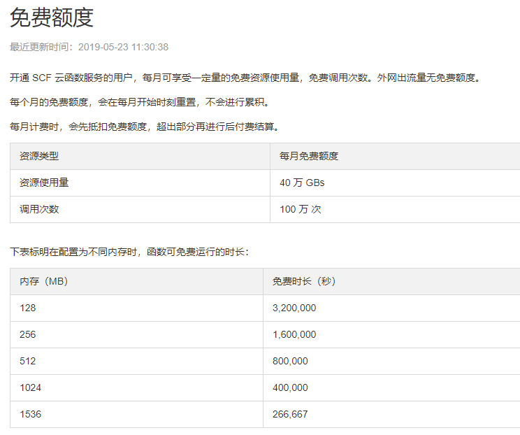
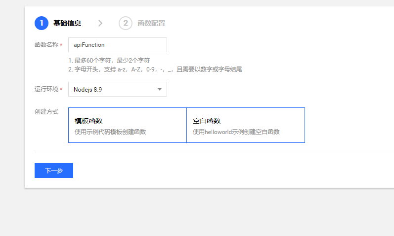
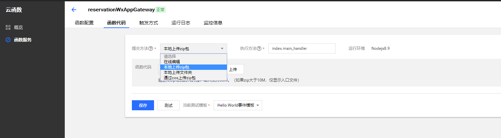
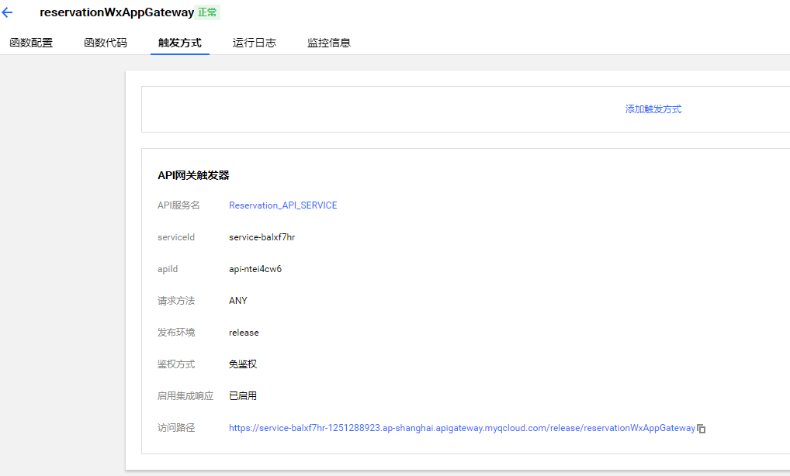
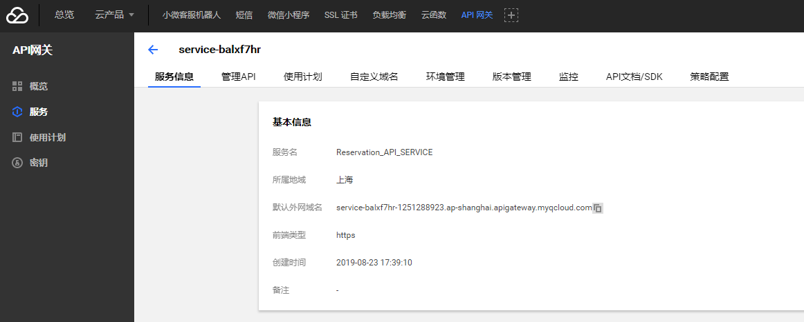

# 预约 API 云函数

## Intro

微信小程序的域名需要备案，但是没有大陆的服务器，而且觉得备案有些繁琐，起初做的小程序都有点想要放弃了，后来了解到腾讯云的云函数，于是利用腾讯云的云函数实现了一个简单的 API 网关，通过云函数来调用真正的 API 地址，借此来绕过域名备案的问题。

## 云函数简介

> 腾讯云云函数（Serverless Cloud Function，SCF）是腾讯云为企业和开发者们提供的无服务器执行环境，帮助您在无需购买和管理服务器的情况下运行代码， 是实时文件处理和数据处理等场景下理想的计算平台。 您只需使用 SCF 平台支持的语言编写核心代码并设置代码运行的条件，即可在腾讯云基础设施上弹性、安全地运行代码。
>
> ## 计算资源的变迁
>
> 随着云服务的发展，计算资源高度抽象化，腾讯云提供了从物理服务器到云函数和横跨各种抽象程度的计算资源供用户选择。
>
> - 黑石物理服务器：以物理机为扩展单位。用户完全拥有整台实体计算资源，安全性最好。
> - 云服务器（CVM）：以云服务器为扩展单位，虚拟化硬件设备。用户和其他租户共享物理机资源，仍可自行配置 CVM 的各项指标，相对部署和迭代更加简单。
> - 容器：以服务为扩展单位，虚拟化操作系统。测试和生产环境完全一致，测试和部署非常轻松。
> - 云函数：以函数为扩展单位，虚拟化运行时环境（Runtime）。是现有计算资源的最小单位，具有完全自动、一键部署、高度可扩展等特点，是轻量级服务部署非常好的选择。
>
> ## 无服务器的概述
>
> 无服务器（Serverless）不是表示没有服务器，而表示当您在使用 Serverless 时，您无需关心底层资源，也无需登录服务器和优化服务器，只需关注最核心的代码片段，即可跳过复杂的、繁琐的基本工作。核心的代码片段完全由事件或者请求触发，平台根据请求自动平行调整服务资源。Serverless 拥有近乎无限的扩容能力，空闲时，不运行任何资源。代码运行无状态，可以轻易实现快速迭代、极速部署。

更多介绍参考[官方文档](https://cloud.tencent.com/document/product/583/9199)

腾讯云函数目前有免费额度可以用，应用不大，基本可以够用：



我的这个只是一个演示功能，免费的额度应该足够了，选用最低的内存配置，运行一个月妥妥的没问题，还会有剩余时间。

> 60 * 60 * 24 * 31 = 2,678,400 < 3,200,000

## 创建云函数

创建云函数：



默认提供了一些模板，可以根据自己需要创建，我这里选择空白函数，选择的运行环境是 nodejs 8.9，然后下一步即可


如果你的方法比较简单可以直接编辑好再完成，如果比较复杂的话可以先完成，在本地编辑好再更新。

## 使用方式

1. 更新云函数

修改 `index.ts` 文件中的要转发的地址

在该目录下执行 `tsc`，生成编译后的 js

到 dist 目录下执行 `npm install`，安装依赖，目前用到的只有一个 `got`，如果用到了别的请在 `package.json` 文件里添加，或者执行 `npm install <package-name> --save`

之后打包 dist 目录下的内容到 zip，然后上传到腾讯云的控制台即可



需要注意，压缩包不能包含 dist 目录，打开压缩包之后就是代码

dist.zip

- -- node_modules
- -- httpRequester.js
- -- index.js
- -- packages.json


2. 配置触发方式：


创建 API 网关触发器之后会在 API 网关那边创建一个服务，并且会得到一个访问的地址






我们访问下面的路径就可以访问到我们的 api 了，示例：

<https://service-balxf7hr-1251288923.ap-shanghai.apigateway.myqcloud.com/release/reservationWxAppGateway/api/notice>

这个请求会实际转发到 <https://reservation.weihanli.xyz/api/notice>

## 实现原理

请求转发，实现一个简单的 API 网关

## 实现过程中遇到的问题

> `unable to verify the first certificate`

这个是 https 请求证书验证的问题，参考 stackoverflow <https://stackoverflow.com/questions/31673587/error-unable-to-verify-the-first-certificate-in-nodejs/32440021>

通过设置了一个环境变量 `NODE_TLS_REJECT_UNAUTHORIZED=0` 来解决了

> 访问 api 404

访问之后，通过看日志，输出请求的地址发现，request 的 path 是带函数名称的，所以将函数名去掉就可以了

``` typescript
if ((<string>event.path).startsWith('/reservationWxAppGateway')) {
    event.path = (<string>event.path).replace('/reservationWxAppGateway', '');
}
```

后来发现在 `event` 的参数里有个 `event.requestContext.path` 来表示云函数的 path，把这个 path 去掉就是真正请求的路径

``` typescript
if((<string>event.path).startsWith(`${event.requestContext.path}`)){
    event.path = (<string>event.path).replace(`${event.requestContext.path}`, '');
}
```

> 请求头的转发

请求头转发的时候， `host` 请求头不能传，我在传递 headers 的时候将 `host` 请求头设置为 `undefined`

``` typescript
headers["host"]= undefined;
```

## 云函数文档

- [云函数免费额度](https://cloud.tencent.com/document/product/583/12282)
- [创建云函数](https://cloud.tencent.com/document/product/583/9207)
- [NodeJs 开发云函数](https://cloud.tencent.com/document/product/583/11060)
- [API 网关触发器](https://cloud.tencent.com/document/product/583/12513)
