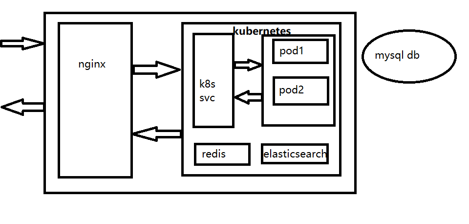
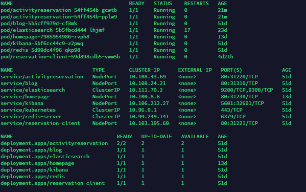

# 活动室预约集群部署

## Intro

活动室预约系统分单机版和集群版，主要致力于集群版的开发，单机版是为了小型系统使用，使用的是 sqlite 数据库，不支持集群模式，

集群版增加了 redis 缓存中间件，通过 redis 实现了一些分布式系统必备的组件，分布式锁，基于 redis pub/sub 的 RedisEventBus，计数器等。

在线示例：

- 新版活动室预约 <https://reservation-client.weihanli.xyz/>（angular8 + asp.net core api)
- 后台管理 <https://reservation.weihanli.xyz/Admin/Account/Login>

## 部署需要

- redis（缓存/分布式锁/EventBus）
- sqlserver/mysql（数据库，也可以换成自己想用的数据库）
- elasticsearch（日志，可以不用，但是推荐使用）

> 下面的配置想要体验的话可以用已有配置，如果要自己部署用的话建议自己注册换成自己的账号

- [sentry](https://sentry.io)（异常日志报警）
- [腾讯验证码](https://007.qq.com/product.html?ADTAG=index.head)（验证码）

## 开始部署

- 本地演示：
项目提供了 docker-compose 的部署方式，你可以在项目根目录下找到 docker-compose.yml， `docker-compose up` 即可

- 生产部署：
项目提供 k8s 部署所需的 yaml 配置，后面会提供一个简单的 helm v3 package 简化部署

## 部署示例

我自己部署了一个 demo，可以在 <https://reservation.weihanli.xyz> 体验

> demo 部署架构

最外层有一个 nginx，nginx 转发请求到 k8s 内部服务，再由 k8s 去调度，选择哪一个 pod 处理请求，

使用到的 redis 和 elasticsearch 均部署在 k8s 的内部，通过 ClusterIP 的方式使用，不直接对外暴露

数据库使用外部的数据库（如果需要也可以像 redis 那样部署成集群内部使用），可以使用云数据库

k8s 部署详情：

k8s 部署 yaml 定义可以参考下面的链接：

- Redis: <https://github.com/WeihanLi/ActivityReservation/blob/dev/redis.yaml>
- ElasticSearch: <https://github.com/WeihanLi/ActivityReservation/blob/dev/elasticsearch.yaml>
- Kibana: <https://github.com/WeihanLi/ActivityReservation/blob/dev/kibana.yaml>
- ActivityReservation:<https://github.com/WeihanLi/ActivityReservation/blob/dev/reservation-deployment.yaml>（使用了 configMap 挂载了配置文件，可以不用）
